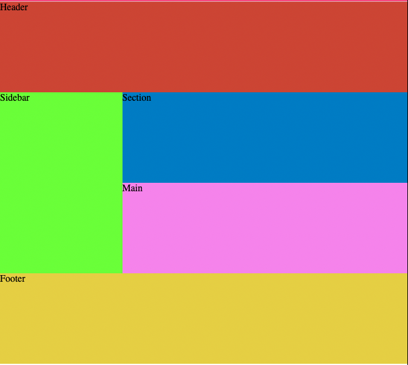

# Grid Layout

Demonstração realizada no youtube de como criar um template usando Grid Layout. 

## Tecnologias 💻

HTML5 - CSS3 

## Link vídeo para visualização

[Grid Layout - youtube](https://alesandraisla.github.io/ping-pong-canvas/)

## Layout

     

